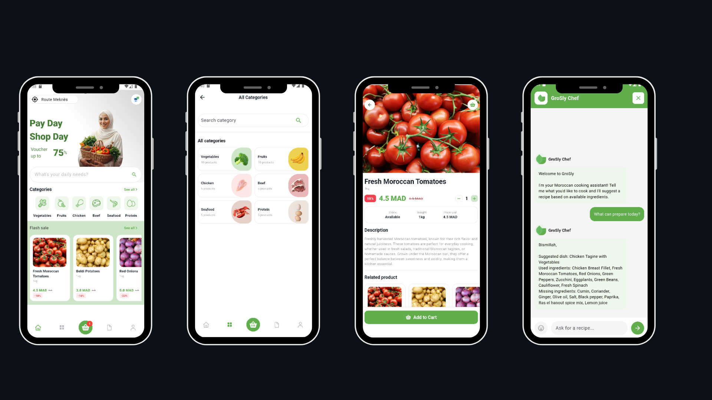

# Grosly - Smart E-Grocery Platform

> *A smart e-grocery app that bridges the gap between your meal plan and a full fridge by delivering exactly what your recipes require.*

## Mission Statement

**To make grocery shopping effortless by combining AI meal planning with instant delivery of fresh, quality products.**

## Vision

**To build Morocco's leading smart grocery platform designed around everyday life.**

---

## Key Features

### Customer Experience
- **Smart Authentication** - Secure login and registration system
- **Intelligent Product Discovery** - Browse by categories with advanced search and filtering
- **AI Recipe Assistant** - Get personalized Moroccan recipe suggestions based on available ingredients
- **Real-time Cart Management** - Seamless shopping cart with instant updates
- **Flexible Checkout** - Multiple payment options including cash on delivery
- **User Profiles** - Manage preferences and delivery addresses

### Business Features
- Dynamic pricing with promotional discounts
- Category-based product organization
- Stock management integration
- Secure payment processing

## Technology Stack

### Frontend
- **Flutter** 3.x - Cross-platform mobile framework
- **Dart** - Programming language
- **Provider** - State management solution
- **Dio** - Advanced HTTP client

### Backend
- **FastAPI** - High-performance REST API
- **PostgreSQL** - Relational database
- **JWT** - Secure authentication
- **AI Integration** - Recipe generation engine

## Screenshots

<p align="center">
  
</p>

---

## Getting Started

### Prerequisites

Ensure you have the following installed:
- Flutter SDK 3.x or higher
- Dart SDK
- Android Studio or VS Code
- Android Emulator or Physical Device

### Installation

1. **Clone the repository**
```bash
git clone https://github.com/ImaneBenchrif/grosly-app.git
cd grosly-app
```

2. **Install dependencies**
```bash
flutter pub get
```

3. **Configure API endpoint**

Edit `lib/client.dart`:

**For Android Emulator:**
```dart
baseUrl: "http://10.0.2.2:8000"
```

**For Physical Device:**
```dart
baseUrl: "http://YOUR_COMPUTER_IP:8000"
```
*Replace `YOUR_COMPUTER_IP` with your actual local IP address*

4. **Run the application**
```bash
flutter run
```

---

## Project Architecture
```
lib/
├── templates/
│   ├── partie_one/              # Authentication Flow
│   │   ├── connexion.dart       # Login/Register
│   │   └── onboarding.dart      # App introduction
│   ├── partie_two/              # Core Application
│   │   ├── home.dart            # Main dashboard
│   │   ├── basket_page.dart     # Shopping cart
│   │   ├── details_page.dart    # Product details
│   │   ├── checkout_page.dart   # Order confirmation
│   │   ├── profile_page.dart    # User settings
│   │   └── bot_page.dart        # AI Recipe Assistant
│   └── providers/               # State Management
│       └── global_variables.dart
├── client.dart                  # API Client (Dio)
└── main.dart                    # Application Entry Point
```

---

## Related Repositories

**Backend API**: [grosly_backend](https://github.com/ImaneBenchrif/grosly_backend)  
*FastAPI-powered REST API with PostgreSQL database*

---

## Development Team

**Imane Benchrif**  
GitHub: [@ImaneBenchrif](https://github.com/ImaneBenchrif)

**Imane Amaaz**  
GitHub: [@ImaneAmaaz](https://github.com/Imaneamaaz)

---

## License

This project is developed for educational purposes as part of an academic program.

---

## Contact & Support

For questions, feature requests, or bug reports, please open an issue on GitHub.

---

<p align="center">
  <em>Made with ❤️ for Morocco's grocery shoppers</em>
</p>
