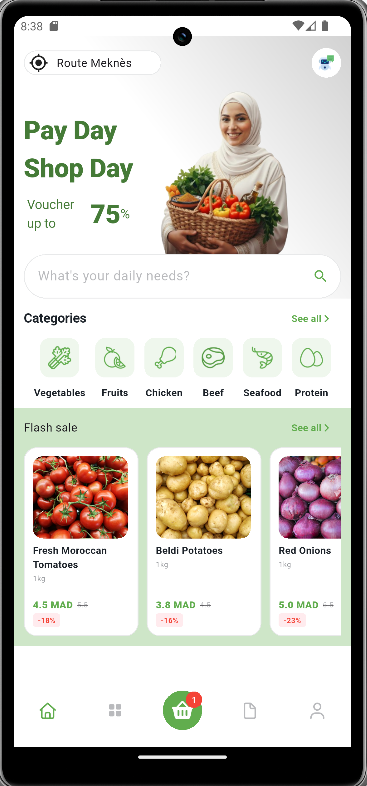
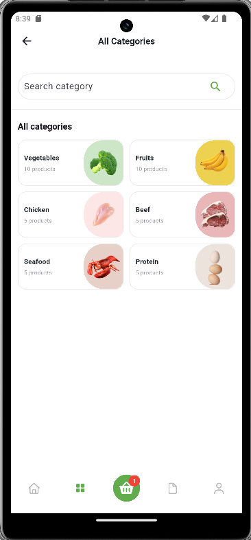

# Grosly - Grocery Delivery Mobile App

A modern Flutter application for grocery delivery with a clean UI and seamless user experience.

## Features

- User authentication (Login/Register)
- Product browsing by categories
- Product search and filtering
- Shopping cart management
- AI-powered chatbot assistant
- Order checkout and tracking
- User profile management
- Discount and promo pricing
- Cash on delivery payment

## Technologies

- **Flutter** 3.x
- **Dart**
- **Provider** (State Management)
- **Dio** (HTTP Client)
- **FastAPI Backend** (REST API)
- **PostgreSQL** (Database)

## Screenshots

<p align="center">
  
  
  
  
</p>

## Getting Started

### Prerequisites

- Flutter SDK 3.x or higher
- Dart SDK
- Android Studio / VS Code
- Android Emulator or Physical Device

### Installation

1. Clone the repository
```bash
git clone https://github.com/ImaneBenchrif/grosly-app.git
cd grosly-app
```

2. Install dependencies
```bash
flutter pub get
```

3. Configure the API endpoint in `lib/client.dart`

For **Android Emulator**:
```dart
baseUrl: "http://10.0.2.2:8000/grosly_api_office"
```

For **Physical Device** (replace with your computer's IP):
```dart
baseUrl: "http://192.168.x.x:8000/grosly_api_office"
```

4. Run the app
```bash
flutter run
```

## Project Structure
```
lib/
├── templates/
│   ├── partie_one/        # Onboarding & Authentication
│   │   ├── connexion.dart
│   │   └── onboarding.dart
│   ├── partie_two/        # Main App Pages
│   │   ├── home.dart
│   │   ├── basket_page.dart
│   │   ├── details_page.dart
│   │   ├── checkout_page.dart
│   │   ├── profile_page.dart
│   │   └── bot_page.dart
│   └── providers/         # State Management
│       └── global_variables.dart
├── client.dart            # API Client (Dio)
└── main.dart             # App Entry Point
```

## Backend Repository

[Grosly Backend API](https://github.com/ImaneBenchrif/grosly_backend)

## Authors

**Imane Benchrif**
- GitHub: [@ImaneBenchrif](https://github.com/ImaneBenchrif)

**Imane Amaaz**
- GitHub: [@ImaneAmaaz](https://github.com/Imaneamaaz)

## License

This project is for educational purposes.
